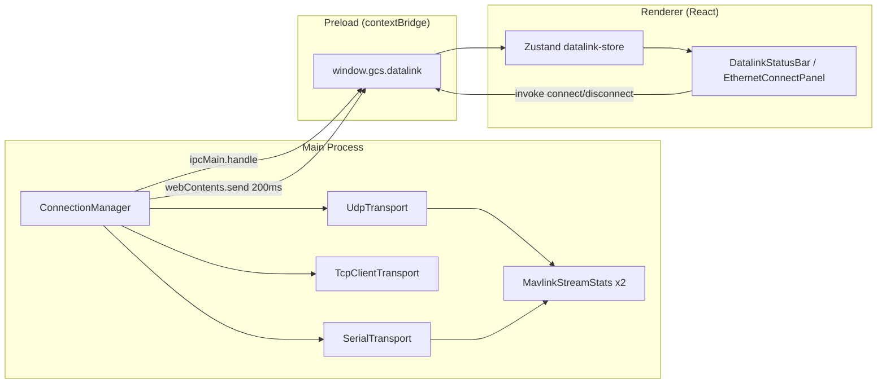

# MDT GCS — Architecture Guide

> ArduPilot multicopter / VTOL · Electron + React · Dual datalink (H16 RF + SprintLink Ethernet)

This document is the **single source of truth** for how the Main Process (connection layer) talks to the Renderer (Zustand UI). Share this file with collaborators (e.g. Gemini) when drafting the next implementation prompts.

---

## 1. Design goals

| Goal | Approach |
|------|----------|
| Dual independent links | Two `DatalinkId`s: `ethernet`, `h16_rf` — each has its own socket/serial transport and `MavlinkStreamStats` |
| MAVLink metrics | Sequence-gap loss rate + HEARTBEAT interval deviation as latency proxy |
| Security | `contextIsolation: true`, no `nodeIntegration` in renderer; sockets only in Main |
| Field UX | Top toolbar signal lamps; compact Ethernet connect panel; high-contrast dark theme |
| Extensibility | Future map/HUD/mission modules consume the same Zustand store + IPC |

---

## 2. Directory structure

```
MDT_GCS/
├── docs/
│   └── ARCHITECTURE.md          # This guide
├── shared/
│   └── types/
│       └── datalink.ts          # IPC contracts, DatalinkSnapshot (main + renderer)
├── electron/                    # MAIN PROCESS — privileged I/O
│   ├── main.ts                  # Window + IPC registration
│   ├── preload.ts               # contextBridge → window.gcs
│   └── connection/
│       ├── connection-manager.ts
│       ├── mavlink-stats.ts
│       ├── link-quality.ts
│       ├── udp-socket.ts
│       ├── tcp-socket.ts
│       └── serial-port.ts
├── src/                         # RENDERER — React UI
│   ├── stores/
│   │   └── datalink-store.ts    # Zustand (recommended over Redux for this scale)
│   ├── components/
│   │   ├── toolbar/             # DatalinkStatusBar, SignalLamp
│   │   └── connection/        # EthernetConnectPanel
│   └── theme/
│       └── dark-theme.css
├── index.html
├── vite.config.ts
└── package.json
```

**Planned growth** (not yet implemented):

```
src/features/map/
src/features/mission/
electron/mavlink/router.ts       # Fan-in / priority when both links active
```

---

## 3. Process model (Electron)



### Why Zustand (not Redux) here

- **Low boilerplate** for 1–2 domains (datalink now; mission/map later).
- **Push-friendly**: IPC snapshot handler maps 1:1 to `set({ snapshots })`.
- If mission state grows complex, add a second slice or migrate to Redux Toolkit — **IPC contracts in `shared/types` stay unchanged**.

---

## 4. IPC contract

Defined in `shared/types/datalink.ts`:

| Channel | Direction | Purpose |
|---------|-----------|---------|
| `datalink:snapshot` | Main → Renderer (event, ~200 ms) | `DatalinkSnapshot[]` metrics push |
| `datalink:ethernet:connect` | Renderer → Main (invoke) | Open UDP/TCP with options |
| `datalink:ethernet:disconnect` | invoke | Tear down ethernet transport |
| `datalink:h16:connect` | invoke | Open serial port |
| `datalink:h16:disconnect` | invoke | Close serial |
| `datalink:serial:list` | invoke | List USB/COM ports |

**Rule:** Never pass raw `Buffer` or sockets to the renderer. Only serializable snapshots and connect options.

---

## 5. UDP receive path (Main Process)

1. `UdpTransport` binds or connects (`udp-client` / `udp-server`).
2. `socket.on('message')` emits `data` chunks.
3. `ConnectionManager` routes chunks to the link’s `MavlinkStreamStats.ingest()`.
4. Timer (`METRICS_INTERVAL_MS = 200`) builds `DatalinkSnapshot[]` and `webContents.send(DATALINK_SNAPSHOT)`.
5. Preload forwards to `window.gcs.datalink.onSnapshot`.
6. Zustand `subscribeIpc()` updates `snapshots` → toolbar re-renders.

### Default port

`DEFAULT_MAVLINK_PORT = 14550` (MAVLink convention).

---

## 6. MAVLink statistics (per link)

`MavlinkStreamStats`:

- Parses MAVLink v1 (`0xFE`) and v2 (`0xFD`) frames from arbitrary TCP/UDP chunk boundaries.
- **Loss rate**: per `(sysid, compid)` sequence gaps on the 0–255 counter.
- **Latency**: EWMA of deviation from expected 1000 ms HEARTBEAT interval (one-way proxy until TIMESYNC is added).
- **Staleness**: `lastPacketAgeMs` — if &gt; 3 s, quality → `poor`.

`computeLinkQuality()` maps metrics to `good | degraded | poor | offline` for the signal lamp (green / yellow / red).

---

## 7. Renderer state flow

```typescript
// Mount once in App.tsx
useEffect(() => useDatalinkStore.getState().subscribeIpc(), []);

// User clicks Connect
await window.gcs.datalink.connectEthernet({ mode, host, port });
// → immediate snapshot return from invoke + ongoing push every 200ms

// UI reads
const snapshots = useDatalinkStore(s => s.snapshots);
```

Ethernet form state (`host`, `port`, `mode`) lives in Zustand so the mini panel and future persistence share one source.

---

## 8. Dual-link strategy (roadmap)

Current scaffold: **monitor both links independently**. Next steps for ArduPilot GCS:

1. **MavlinkRouter** in Main: dedupe by `(sysid, compid, msgid, seq)` when the same packet arrives on both links.
2. **Active link selection**: prefer Ethernet when `quality === 'good'`, fall back to H16 RF.
3. **Command egress**: send commands only on the selected link; optional hot-standby heartbeat on backup.

Document this in the next prompt so implementation stays in Main, not React.

---

## 9. Development commands

```bash
npm install
npm run electron:dev    # Vite + Electron with HMR
npm run typecheck
npm run build
```

Without Electron (`npm run dev` only), `window.gcs` is undefined — UI shows a bridge error; always test datalink under `electron:dev`.

---

## 10. Sharing with Gemini / team

When generating the **next prompt**, include:

1. This file path: `docs/ARCHITECTURE.md`
2. Which layer you are extending: `electron/connection/*` vs `src/features/*`
3. Whether behavior changes IPC (`shared/types/datalink.ts` must be updated first)

Public repo: see root `README.md` for clone URL.
